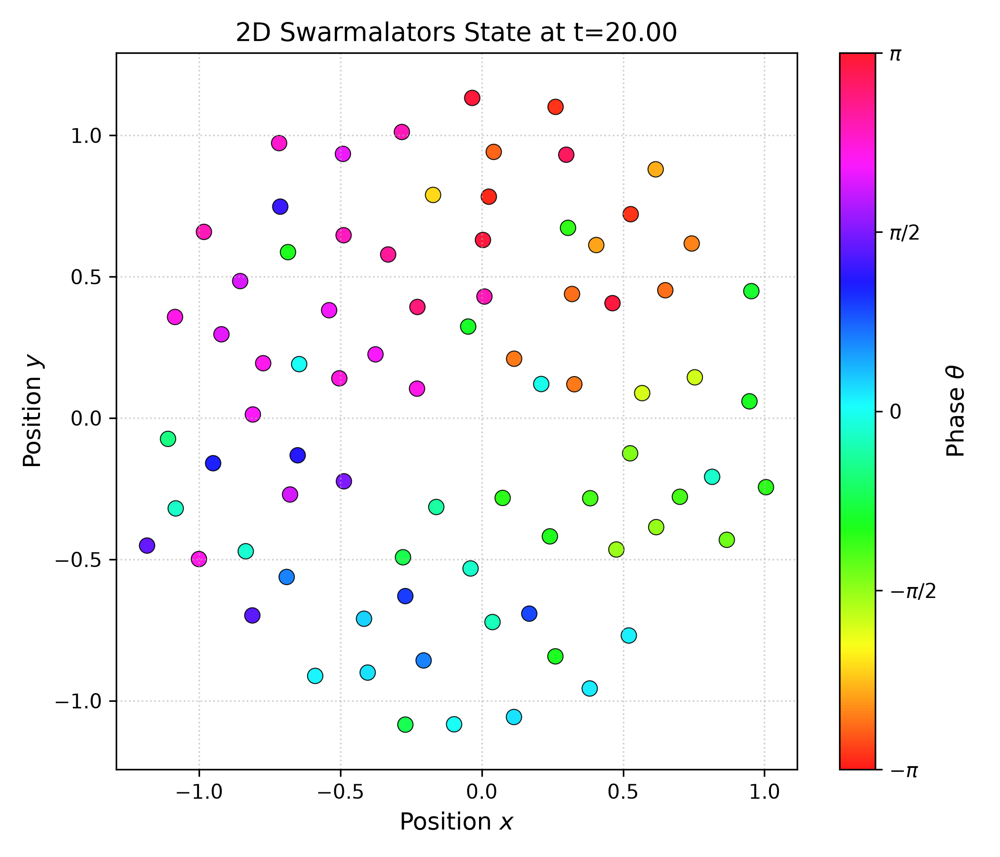
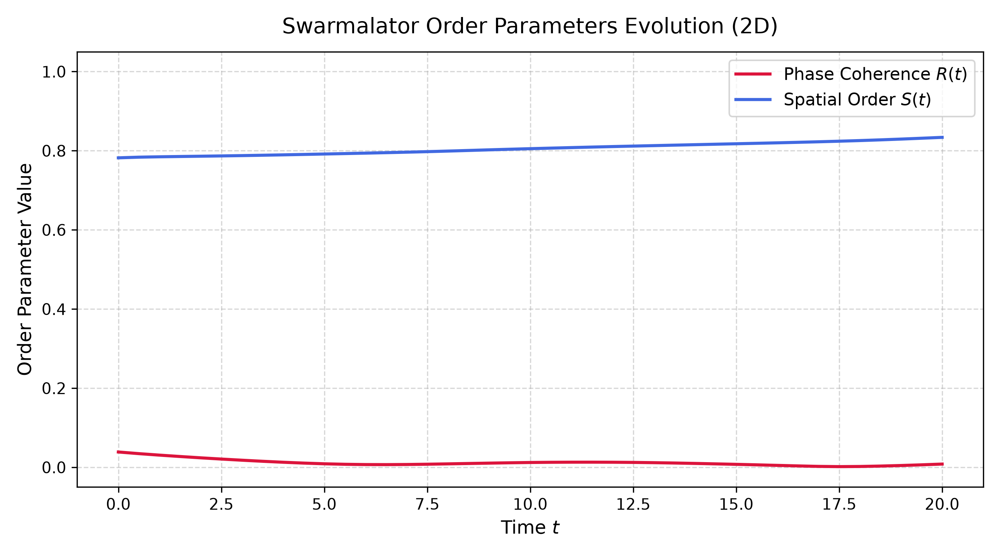

# 🌌 Swarm-Lab-RS

> **Swarmalator（群聚同步振子）动力学理论学习与全系列论文复现实验室**
> 
> 基于 **Rust 高性能仿真引擎** 与 **Python 科学可视化**，系统性复现 [Khev/swarmalators](https://github.com/Khev/swarmalators) 及相关学术论文。

[](https://www.rust-lang.org/)
[](https://www.python.org/)
[](LICENSE)
[](#-论文复现矩阵与路线图)

<div align="center">
  
  
  <p><em>左图：二维静态相位波状态（Static Phase Wave，空间彩虹盘）；右图：序参量时间演化曲线。</em></p>
</div>

---

## 📖 1. 背景与物理机制 (Theoretical Background)

在自然界中，群体协同往往同时涉及**空间自组织**（鸟群聚集、细菌集群、游鱼成团）与**内部节律同步**（萤火虫同步发光、心肌细胞跳动、蟋蟀齐鸣）。

传统的非线性动力学通常将两者割裂研究：
- **Kuramoto 模型**：仅考虑相位的全局耦合同步，忽略空间运动；
- **Vicsek / Reynolds 鸟群模型**：仅考虑空间速度对齐与聚集，缺少内部相位振子。

2017 年，Kevin O'Keeffe、Hyunsuk Hong 与 Steven H. Strogatz 在 *Nature Communications* 提出 **Swarmalators（Swarming + Oscillators）**：
- **双向双耦合机制**：
  1. **空间运动依赖内部相位差**：相位越接近的个体，空间相互吸引越强（“同相相吸、异相相斥”）；
  2. **相位同步依赖空间欧氏距离**：空间距离越近的个体，相位耦合强度越强。
- **涌现丰富的宏观相态**：
  - **静态同步相 (Static Synchrony)**：聚集为致密团簇，相位完全锁相（$R \approx 1$）；
  - **静态异步相 (Static Asynchrony)**：空间展开，相位均匀杂乱分布（$R \approx 0$）；
  - **静态相位波 (Static Phase Wave)**：空间极角与内部相位形成完美严格相关（彩虹盘结构，$S_{\pm} \approx 1$）；
  - **主动相位波 (Active Phase Wave)**：非稳态，粒子在空间环流旋转，相位呈行波传播；
  - **破碎相位波 (Splintered Phase Wave)**：类似于 Chimera（奇美拉相）的群聚聚集。

---

## 🗺️ 2. 论文复现矩阵与路线图 (Paper Roadmap)

本项目严格追踪 [Khev/swarmalators](https://github.com/Khev/swarmalators) 中的核心论文系列。**所有论文 PDF 均已拉取到本地，并在 `examples/` 预建好可直接运行和编写实验的专属脚本**：

| # | 论文题目 | 发表期刊 / 年份 | 本地阅读 (PDF) | 本地学习目录 | 专属复现与代码实验脚本 |
| :---: | :--- | :---: | :---: | :--- | :--- |
| 01 | [Oscillators that sync and swarm](https://www.nature.com/articles/s41467-017-01190-3) | *Nature Comms* 2017 | 📄 [打开 PDF](papers/2d-plane/01-sync-and-swarm-natcomm2017/paper.pdf) | [`papers/2d-plane/01-sync-and-swarm`](papers/2d-plane/01-sync-and-swarm-natcomm2017/) | ⚡ [`01_natcomm2017_oscillators_sync_and_swarm.rs`](crates/swarm-cli/examples/01_natcomm2017_oscillators_sync_and_swarm.rs) |
| 02 | [Ring states in swarmalator systems](https://journals.aps.org/pre/abstract/10.1103/PhysRevE.98.022203) | *Phys. Rev. E* 2018 | 📄 [打开 PDF](papers/1d-ring/01-ring-states-pre2018/paper.pdf) | [`papers/1d-ring/01-ring-states`](papers/1d-ring/01-ring-states-pre2018/) | ⚡ [`02_pre2018_ring_states.rs`](crates/swarm-cli/examples/02_pre2018_ring_states.rs) |
| 03 | [Collective behavior of swarmalators on a ring](https://journals.aps.org/pre/abstract/10.1103/PhysRevE.105.014211) | *Phys. Rev. E* 2022 | 📄 [打开 PDF](papers/1d-ring/02-collective-ring-pre2022/paper.pdf) | [`papers/1d-ring/02-collective-ring`](papers/1d-ring/02-collective-ring-pre2022/) | ⚡ [`03_pre2022_collective_ring.rs`](crates/swarm-cli/examples/03_pre2022_collective_ring.rs) |
| 04 | [Solvable model of non-identical swarmalators](https://journals.aps.org/prl/abstract/10.1103/PhysRevLett.129.208002) | *Phys. Rev. Lett.* 2022 | 📄 [打开 PDF](papers/1d-ring/03-non-identical-prl2022/paper.pdf) | [`papers/1d-ring/03-non-identical`](papers/1d-ring/03-non-identical-prl2022/) | ⚡ [`04_prl2022_solvable_non_identical.rs`](crates/swarm-cli/examples/04_prl2022_solvable_non_identical.rs) |
| 05 | [Swarmalators on a ring with distributed couplings](https://journals.aps.org/pre/abstract/10.1103/PhysRevE.105.064208) | *Phys. Rev. E* 2022 | 📄 [打开 PDF](papers/1d-ring/04-distributed-couplings-pre2022/paper.pdf) | [`papers/1d-ring/04-distributed-couplings`](papers/1d-ring/04-distributed-couplings-pre2022/) | ⚡ [`05_pre2022_distributed_couplings.rs`](crates/swarm-cli/examples/05_pre2022_distributed_couplings.rs) |
| 06 | [Mixed sign interactions in the 1D swarmalator model](https://arxiv.org/abs/2309.02342) | *arXiv* 2023 | 📄 [打开 PDF](papers/1d-ring/05-mixed-interactions-arxiv2023/paper.pdf) | [`papers/1d-ring/05-mixed-interactions`](papers/1d-ring/05-mixed-interactions-arxiv2023/) | ⚡ [`06_arxiv2023_mixed_sign_interactions.rs`](crates/swarm-cli/examples/06_arxiv2023_mixed_sign_interactions.rs) |
| 07 | [Pinning in a system of swarmalators](https://arxiv.org/abs/2211.02353) | *arXiv* 2022 | 📄 [打开 PDF](papers/1d-ring/06-pinning-transitions-arxiv2022/paper.pdf) | [`papers/1d-ring/06-pinning-transitions`](papers/1d-ring/06-pinning-transitions-arxiv2022/) | ⚡ [`07_arxiv2022_pinning_and_domain_walls.rs`](crates/swarm-cli/examples/07_arxiv2022_pinning_and_domain_walls.rs) |
| 08 | [A solvable two dimensional swarmalator model](https://arxiv.org/abs/2312.10178) | *arXiv* 2023 | 📄 [打开 PDF](papers/2d-plane/04-solvable-2d-arxiv2023/paper.pdf) | [`papers/2d-plane/04-solvable-2d`](papers/2d-plane/04-solvable-2d-arxiv2023/) | ⚡ [`08_arxiv2023_solvable_2d_swarmalator.rs`](crates/swarm-cli/examples/08_arxiv2023_solvable_2d_swarmalator.rs) |
| 09 | [Swarmalators with thermal noise](https://journals.aps.org/prresearch/abstract/10.1103/PhysRevResearch.5.023105) | *Phys. Rev. Research* 2023 | 📄 [打开 PDF](papers/2d-plane/05-thermal-noise-prresearch2023/paper.pdf) | [`papers/2d-plane/05-thermal-noise`](papers/2d-plane/05-thermal-noise-prresearch2023/) | ⚡ [`09_prresearch2023_thermal_noise.rs`](crates/swarm-cli/examples/09_prresearch2023_thermal_noise.rs) |
| 10 | [Diverse behaviors in swarmalator systems](https://www.nature.com/articles/s41467-023-36563-4) | *Nature Comms* 2023 | 📄 [打开 PDF](papers/2d-plane/06-diverse-behaviors-natcomm2023/paper.pdf) | [`papers/2d-plane/06-diverse-behaviors`](papers/2d-plane/06-diverse-behaviors-natcomm2023/) | ⚡ [`10_natcomm2023_diverse_behaviors.rs`](crates/swarm-cli/examples/10_natcomm2023_diverse_behaviors.rs) |
| 11 | [Solvable model of driven matter with pinning](https://arxiv.org/abs/2306.09589) | *arXiv* 2023 | 📄 [打开 PDF](papers/1d-ring/07-driven-matter-pinning-arxiv2023/paper.pdf) | [`papers/1d-ring/07-driven-matter`](papers/1d-ring/07-driven-matter-pinning-arxiv2023/) | ⚡ 参考 07 实验扩展 |
| 12 | [Swarmalators with delayed interactions](https://arxiv.org/abs/2210.11417) | *arXiv* 2022 | 📄 [打开 PDF](papers/delayed-interactions/paper.pdf) | [`papers/delayed-interactions`](papers/delayed-interactions/) | ⚡ 参考时滞扩展 |
| 13 | [Microscopic activity patterns in the Naming Game](https://arxiv.org/abs/cond-mat/0606125) | *J. Phys. A* 2006 | 📄 [打开 PDF](papers/naming-game/01-microscopic-activity-condmat2006/paper.pdf) | [`papers/naming-game/01-microscopic-activity`](papers/naming-game/01-microscopic-activity-condmat2006/) | ⚡ [`11_condmat2006_naming_game_activity.rs`](crates/swarm-cli/examples/11_condmat2006_naming_game_activity.rs) |
| 14 | [Consensus formation in multi-agent LLM Naming Games](https://arxiv.org/abs/2608.02178) | *arXiv* 2026 | 📄 [打开 PDF](papers/naming-game/02-llm-naming-game-arxiv2026/paper.pdf) | [`papers/naming-game/02-llm-naming-game`](papers/naming-game/02-llm-naming-game-arxiv2026/) | ⚡ [`12_arxiv2026_llm_naming_game.rs`](crates/swarm-cli/examples/12_arxiv2026_llm_naming_game.rs) |
| 15 | [Minority game with local interactions due to the presence of herding behavior](https://arxiv.org/abs/physics/0512087) | *arXiv* 2005 / *Physica A* | 📄 [打开 PDF](papers/minority-game/01-herding-behavior-physics0512087/paper.pdf) | [`papers/minority-game/01-herding-behavior`](papers/minority-game/01-herding-behavior-physics0512087/) | ⚡ [`13_physics0512087_minority_game_herding.rs`](crates/swarm-cli/examples/13_physics0512087_minority_game_herding.rs) |


---

## 🏗️ 3. 仓库架构 (Repository Architecture)

为同时兼顾**极致计算性能（$O(N^2)$ 两两粒子相互作用）**与**灵活的科研作图分析**，本项目采用 **Rust (计算核心) + Python (分析可视化)** 混合架构：

```
swarm-lab-rs/
├── Cargo.toml                    # Rust 虚拟工作区配置 (Workspace)
├── LICENSE                       # MIT 开源协议
├── README.md                     # 项目主文档与论文索引
├── crates/
│   ├── swarm-core/               # 核心库：ODE 积分器 (RK4/Euler)、序参量、模型动力学定义
│   │   ├── Cargo.toml
│   │   └── src/
│   │       ├── lib.rs
│   │       ├── types.rs          # 动力系统 Trait、状态快照
│   │       ├── integrator.rs     # 高性能无内存分配 RK4 积分器
│   │       ├── metrics.rs        # Kuramoto R, 空间序 S, 时空关联 S_±, 回转半径
│   │       ├── models/           # 各论文动力学微分方程实现
│   │       │   ├── nature2017_2d.rs  # 2017 Nature Comms 2D 模型 (Rayon 并行加速)
│   │       │   └── ring_1d.rs        # 1D 圆环模型 (Rayon 并行加速)
│   │       ├── naming_game/      # 命名博弈与微观动力学 (Direct & LLM 模型)
│   │       └── minority_game/    # 少数派博弈与从众羊群效应 (策略表、网络模仿与相变)
│   └── swarm-cli/                # 统一仿真命令行工具
│       ├── Cargo.toml
│       ├── examples/             # 各篇论文的专属独立复现与出图脚本 (01 ~ 13)
│       └── src/
│           └── main.rs           # 命令行参数解析、进度条与 CSV 轨迹流式输出
├── papers/                       # 论文学习笔记与复现档案 (按拓扑分类)
│   ├── 00-template/              # 论文复现标准模板 (公式、相图、复现自查表)
│   ├── 1d-ring/                  # 1D 圆环体系
│   ├── 1d-line/                  # 1D 线段体系
│   ├── 2d-plane/                 # 2D 连续平面与环面体系
│   ├── naming-game/              # 命名博弈复杂网络与大模型群体智能体系
│   └── minority-game/            # 少数派博弈、从众效应与金融物理体系
├── python/                       # 科学作图与动画渲染脚本
│   ├── requirements.txt
│   ├── plot_phases.py            # 相位空间散点图与序参量时间演化曲线
│   ├── animate.py                # 生成粒子动态演化 GIF / MP4
│   ├── plot_naming_game.py       # 命名博弈宏观与微观度分布绘制
│   ├── plot_llm_naming_game.py   # LLM 命名博弈多通道相图
│   └── plot_minority_game.py     # 少数派博弈波动率相变与市场振荡曲线
├── docs/                         # 理论专题文档
│   └── swarmalator_primer.md     # Swarmalator 理论基础指南与数学推导
├── data/                         # 存放仿真轨迹 CSV / 数据缓存 (默认 git-ignore)
└── output/                       # 存放高清图片与动图输出 (默认 git-ignore)
```

---

## 🚀 4. 快速上手 (Quick Start)

### 4.1 环境准备
- **Rust**（推荐 1.75+）：
  ```bash
  curl --proto '=https' --tlsv1.2 -sSf https://sh.rustup.rs | sh
  ```
- **Python 环境**（推荐使用 `uv` 极速包管理器）：
  ```bash
  pip install -r python/requirements.txt
  # 或者直接使用 uv 运行（无需手动配置环境）
  ```

### 4.2 运行经典二维模型仿真 (Nature Comms 2017)
通过并行化的 `swarm-cli` 运行 200 个粒子 3000 步的仿真（仅需约 0.2 秒）：
```bash
# 模拟 2D 静态相位波相态 (Static Phase Wave: J=0.5, K=-0.2)
cargo run --release -p swarm-cli -- \
  --model 2d \
  -n 200 \
  -j 0.5 \
  -k -0.2 \
  --steps 3000 \
  --dt 0.05 \
  --output data/trajectory.csv \
  --metrics-output data/metrics.csv
```

### 4.3 运行一维圆环模型仿真 (PRE 2018)
```bash
# 模拟 1D 圆环相位波相态
cargo run --release -p swarm-cli -- \
  --model ring \
  -n 150 \
  -j 0.5 \
  -k -0.5 \
  --steps 2000 \
  --output data/ring_trajectory.csv \
  --metrics-output data/ring_metrics.csv
```

### 4.4 可视化与作图
一键生成粒子空间分布相图与序参量收敛过程：
```bash
# 使用 uv 或 python3 执行
uv run python/plot_phases.py --traj data/trajectory.csv --metrics data/metrics.csv --model 2d --outdir output
```
图表将保存于 `output/`：
- `output/final_state.png`：空间中粒子位置，颜色对应相位 $\theta \in [-\pi, \pi)$；
- `output/metrics_evolution.png`：$R(t)$ 与空间序参量演化。

### 4.5 生成动力学演化动画 (GIF / MP4)
```bash
uv run python/animate.py --traj data/trajectory.csv --output output/evolution.gif --model 2d --fps 30
```

---

## 📝 5. 论文学习与复现工作流 (Workflow)

当开始复现一篇新论文时，建议遵循以下流程：
1. **新建论文目录**：参考 [`papers/00-template/README.md`](papers/00-template/README.md)，在 `papers/` 对应分类下新建文件夹；
2. **理论推导与梳理**：在论文 README 中记录控制方程、序参量定义、稳态解与线性稳定性分析结论；
3. **编写/扩展动力学模型**：在 `crates/swarm-core/src/models/` 实现对应微分方程；
4. **运行参数扫描**：使用 `swarm-cli` 模拟不同 $(J, K)$ 参数点，计算极限环或渐进相态；
5. **复现原论文配图**：使用 Python 脚本生成相图对比原作者结论，整理到笔记中。

---

## 📚 6. 核心序参量对照 (Order Parameters)

| 序参量 | 数学表达式 | 物理意义 |
| :--- | :--- | :--- |
| **Kuramoto 相位相干度 $R$** | $R = \left\| \frac{1}{N} \sum_{j=1}^N e^{i \theta_j} \right\|$ | $R \to 1$ 表示全同锁相，$R \to 0$ 表示相位杂乱分散 |
| **圆环空间聚集度 $S$** | $S = \left\| \frac{1}{N} \sum_{j=1}^N e^{i \phi_j} \right\|$ | $S \to 1$ 表示空间粒子缩为单点，$S \to 0$ 表示粒子均匀占满环面 |
| **时空关联相位波序 $S_{\pm}$** | $S_{\pm} = \left\| \frac{1}{N} \sum_{j=1}^N e^{i (\phi_j \pm \theta_j)} \right\|$ | $S_+ \approx 1$ 或 $S_- \approx 1$ 表明相位与空间严格线性绑定 ($\theta = \mp \phi + C$) |
| **二维回转半径 $R_{\text{gyr}}$** | $R_{\text{gyr}} = \sqrt{\frac{1}{N} \sum \|\mathbf{x}_j - \bar{\mathbf{x}}\|^2}$ | 衡量 2D 粒子群在空间中的伸展弥散半径 |

---

## 🤝 鸣谢与致敬 (Acknowledgments)
- 感谢 Kevin O'Keeffe、Hyunsuk Hong 与 Steven H. Strogatz 等学者在 Swarmalator 系统开创性的工作。
- 原作者参考代码库：[Khev/swarmalators](https://github.com/Khev/swarmalators)。

---

## 📄 开源协议 (License)
本项目采用 [MIT 协议](LICENSE) 开源。
